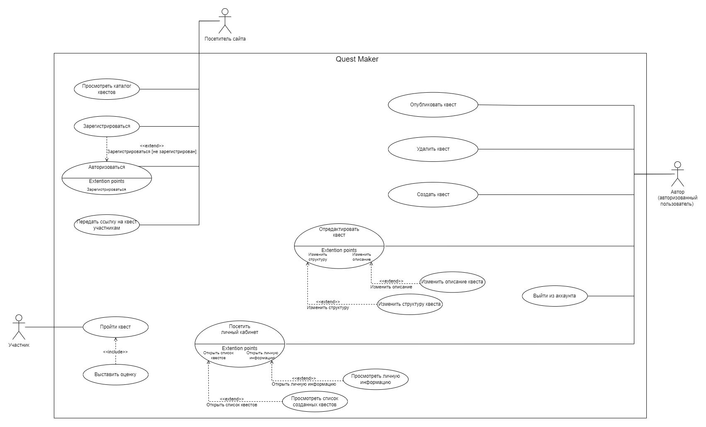

# Бизнес-требования

Разрабатываемая система (далее Quest-Maker) предназначена для создания и прохождения квестов в онлайн формате.

## Действующие лица

С системой взаимодействуют следующие действующие лица:
- Участник - человек, который проходит квест с помощью telegram-бота
- Посетитель сайта - человек, зашедший на сайт
- Организатор - пользователь сайта, который выбирает квест на сайте и присылает участникам ссылку на квест
- SMTP сервер - сервер для отправки сообщений на e-mail
- Автор - пользователь сайта, который создает и редактирует квесты

## Варианты использования

Варианты использования - высокоуровневые сценарии, описывающие задачи, которые выполняет система и действующие лица, которые в этих сценариях участвуют.

### Классификация по действующим лицам

**Участник**
- Прохождение квеста по полученной ссылке
- Отзыв о квесте

**Посетитель сайта**
- Просмотр каталога квестов
- Регистрация на сайте
- Авторизация на сайте

**Организатор**
- Просмотр каталога квестов
- Рассылка приглашений участникам

**SMTP сервер**
- Рассылка приглашений участникам

**Автор**
- Просмотр информации в личном кабинете
  - Просмотр личной информации
  - Просмотр списка созданных квестов
- Создание квестов
- Редактирование квестов
  - Измение описания
  - Изменение структуры
- Публикация квеста
- Удаление квеста
- Выход из аккаунта

Диаграмма вариантов использования приведены на следующем рисунке.

